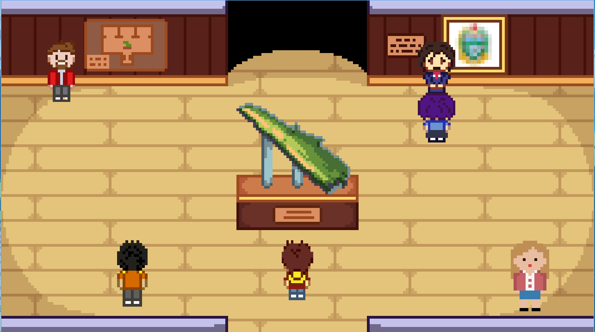

<h1 align="center">The Adventure of Atra</h1>
<p align="center">
  
</p>


[English](./README.md) | **Indonesia**

## Deskripsi Proyek

"The Adventure of Atra" - adalah game petualangan dengan tema eksplorasi museum. Dalam game ini, pemain akan memerankan karakter Atra, seorang petualang muda yang menjelajahi museum untuk belajar dan mengetahui lebih banyak tentang budaya Sumatera. Pemain akan menyelesaikan berbagai teka-teki dan misi untuk mengungkap cerita sejarah dan budaya yang tersembunyi di dalam museum. Game ini menawarkan pengalaman bermain yang santai dan edukatif, yang cocok untuk semua kalangan, terutama bagi mereka yang ingin memperluas pengetahuan mereka tentang budaya Indonesia.

## Library, Framework & Alat yang Digunakan

- [Python 3.11](https://www.python.org/)
- [Pygame](https://www.pygame.org/)

<i>Pastikan Python 3.11 terinstal di komputer Anda (versi lain mungkin tidak berfungsi)</i>

## Cara Bermain

Pemain akan memerankan karakter Atra, seorang petualang muda yang bersemangat untuk belajar dan menjelajahi kekayaan budaya Sumatra. Petualangan dimulai di dalam museum yang menawarkan berbagai ruangan provinsi untuk dijelajahi, seperti Provinsi Lampung, Provinsi Sumatera Utara, dan Provinsi Sumatera Barat.

Setiap ruangan di museum mungkin menyimpan rahasia dan teka-teki yang harus dipecahkan oleh pemain. Pemain dapat menggunakan kontrol untuk memandu Atra melalui museum. Atra dapat bergerak ke empat arah menggunakan tombol WASD atau panah pada keyboard, sambil berinteraksi dengan berbagai item dan objek.

## Screenshots





## Cara Menjalankan

1. Clone repository ini

   ```bash
   git clone https://github.com/jo0707/the-adventure-of-atra.git
   ```

2. Pindah ke direktori proyek

   ```bash
   cd the-adventure-of-atra
   ```

3. Install pygame

   ```bash
   pip install pygame
   ```

4. Jalankan game
   ```bash
   python main.py
   # or
   python3 main.py
   ```

## UML Class Diagram


## Kontributor

| Nama                     | NIM       | Kontribusi                       | Github                                              |
| ------------------------ | --------- | -------------------------------- | --------------------------------------------------- |
| Joshua Palti Sinaga      | 122140141 | Project Leader, Programmer       | [jo0707](https://github.com/jo0707)                 |
| Ikhsannudin Lathief      | 122140137 | Programmer, Designer, Researcher | [tepppla](https://github.com/tepppla)               |
| Irma Amelia Novianti     | 122140128 | Programmer, Designer, Researcher | [irmaamelia45](https://github.com/irmaamelia45)     |
| Alfajar                  | 122140122 | Programmer Designer, Researcher  | [xa-4104](https://github.com/xa-4104)               |
| Sabita Hamdunna Syafitri | 122140154 | Lead Designer, Programmer        | [SabitaOnitsuga](https://github.com/SabitaOnitsuga) |
| Yos Berman Panjaitan     | 121140185 | Programmer, Designer             | [121140185](https://github.com/121140185)           |

## Referensi

- [Design Patterns and Video Games](https://www.patternsgameprog.com/series/discover-python-and-patterns/)
- [PyGame Tutorial: Centralized Scene Logic](https://nerdparadise.com/programming/pygame/part7)
- [pygame.org - TUT_DESIGN](https://www.pygame.org/wiki/tut_design)
- [PyGame: A Primer on Game Programming in Python
  ](https://realpython.com/pygame-a-primer/)

Referensi Game :

- [Stardew Valley](https://www.stardewvalley.net/)

#### Catatan

<i>Game ini masih dalam tahap pengembangan. Beberapa fitur, konten, dan dokumentasi mungkin akan ditambahkan di versi selanjutnya. Masukan dari orang lain sangat dihargai untuk meningkatkan pengalaman bermain.</i>
