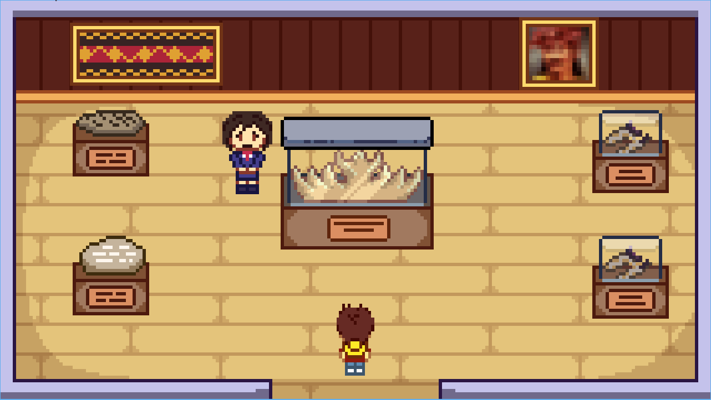

<h1 align="center">The Adventure of Atra</h1>
<p align="center">
  
</p>


**English** | [Indonesia](./README.id-ID.md)

## Project Description
"The Adventure of Atra" - is an adventure game with the theme of museum exploration. In this game, players will play the role of Atra, a young adventurer who explores the museum to learn and know more about Sumatran culture. Players will complete various puzzles and missions to uncover historical and cultural stories hidden within the museum. This game offers a relaxing and educational gaming experience, which is suitable for all groups, especially those who want to expand their knowledge of Indonesian culture.

## Library, Frameworks & Tools Used

- [Python 3.11](https://www.python.org/)
- [Pygame](https://www.pygame.org/)

<i>Make sure to have Python 3.11 installed on your machine (another version may not work)</i>

## How To Play

Players will play the character of Atra, a young adventurer who is eager to learn and explore the rich culture of Sumatra. The adventure begins inside a museum that offers various provincial rooms to explore, such as Lampung Province, North Sumatra Province, and West Sumatra Province.

Each room in the museum may hold secrets and puzzles for the player to solve. Players can use the controls to guide Atra through the museum. Atra can move in four directions using the WASD keys or arrows on the keyboard, while interacting with various items and objects. 

## Screenshots




## How to Run

1. Clone this repository  
    ```bash
    git clone https://github.com/jo0707/the-adventure-of-atra.git
    ```

2. Change directory to the project folder
    ```bash
    cd the-adventure-of-atra
    ```

3. Install pygame
    ```bash
    pip install pygame
    ```

4. Run the game
    ```bash
    python main.py
    # or
    python3 main.py
    ```

## UML Class Diagram


## Contributors

| Name                     | NIM         | Contributions                    | Github                             | 
|--------------------------|-------------|----------------------------------| -----------------------------------|
| Joshua Palti Sinaga      | 122140141   | Project Leader, Programmer                  | [jo0707](https://github.com/jo0707) |
| Ikhsannudin Lathief      | 122140137   | Programmer, Designer, Researcher | [tepppla](https://github.com/tepppla) |
| Irma Amelia Novianti     | 122140128   | Programmer, Designer, Researcher | [irmaamelia45](https://github.com/irmaamelia45) |
| Alfajar                  | 122140122   | Programmer  Designer, Researcher | [xa-4104](https://github.com/xa-4104) |
| Sabita Hamdunna Syafitri | 122140154   | Lead Designer, Programmer        | [SabitaOnitsuga](https://github.com/SabitaOnitsuga) |
| Yos Berman Panjaitan     | 121140185   | Programmer, Designer             | [121140185](https://github.com/121140185) |

## Reference
- [Design Patterns and Video Games](https://www.patternsgameprog.com/series/discover-python-and-patterns/)
- [PyGame Tutorial: Centralized Scene Logic](https://nerdparadise.com/programming/pygame/part7)
- [pygame.org - TUT_DESIGN](https://www.pygame.org/wiki/tut_design)
- [PyGame: A Primer on Game Programming in Python
](https://realpython.com/pygame-a-primer/)

Game Reference :
- [Stardew Valley](https://www.stardewvalley.net/)


#### Note
<i>This game is still under heavy development. Some features, content, and documentation may be added in later versions. Feedback from others is greatly appreciated to improve the gaming experience.</i>

